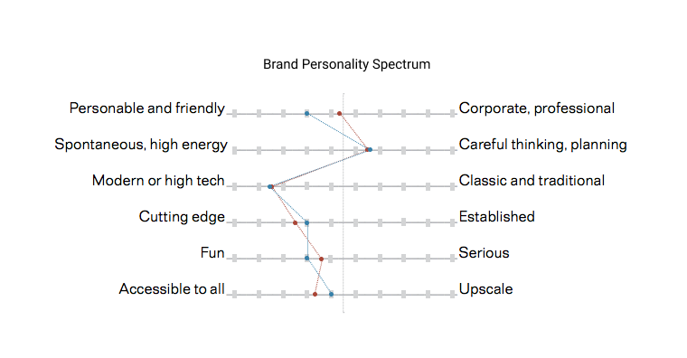
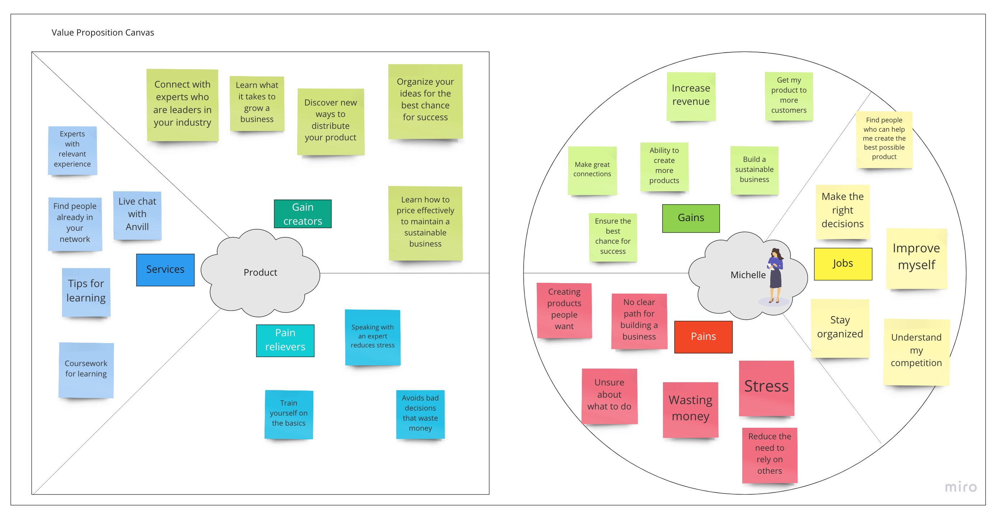
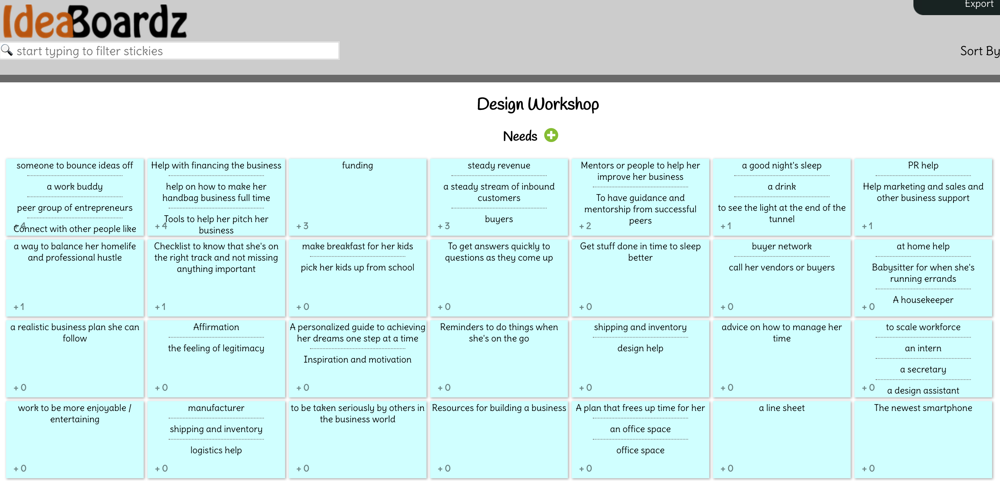
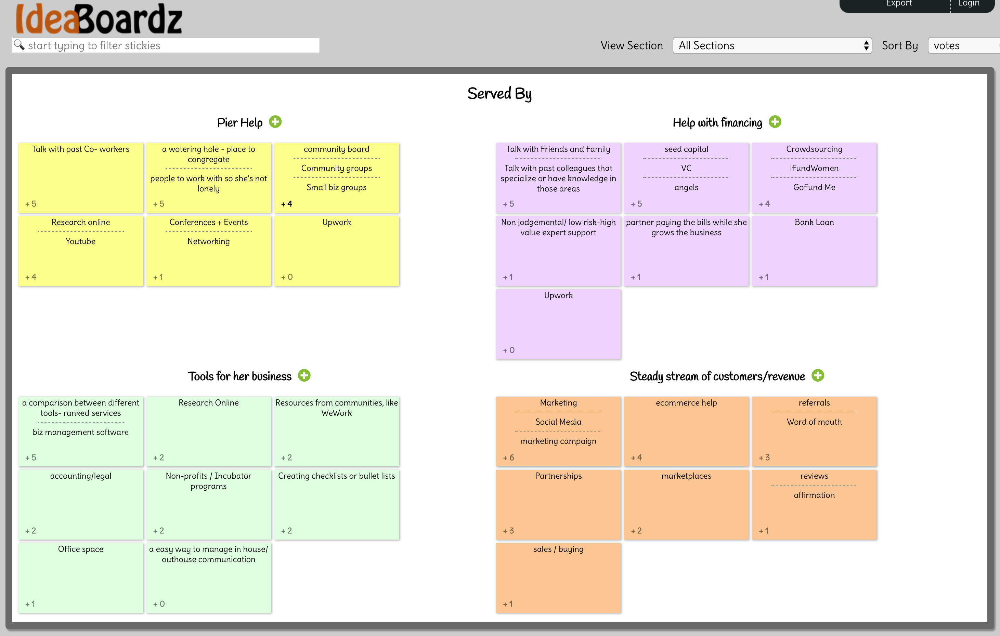
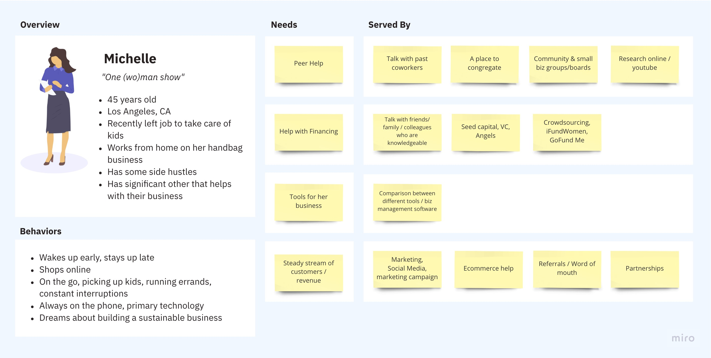
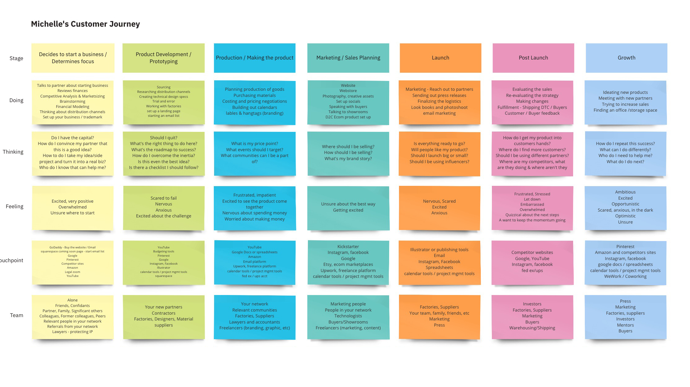
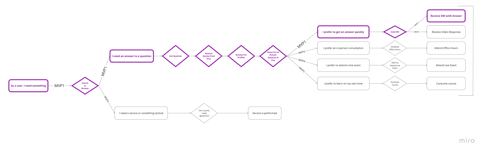
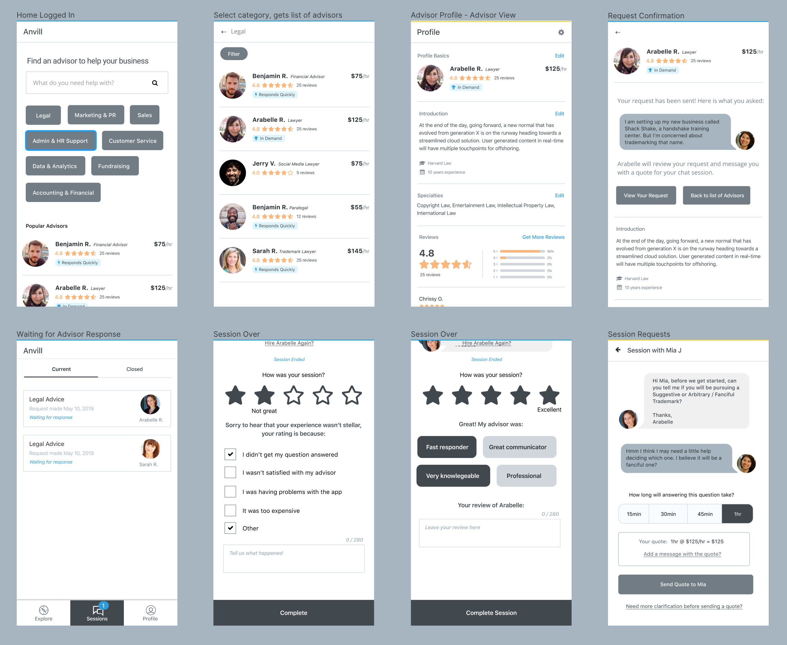
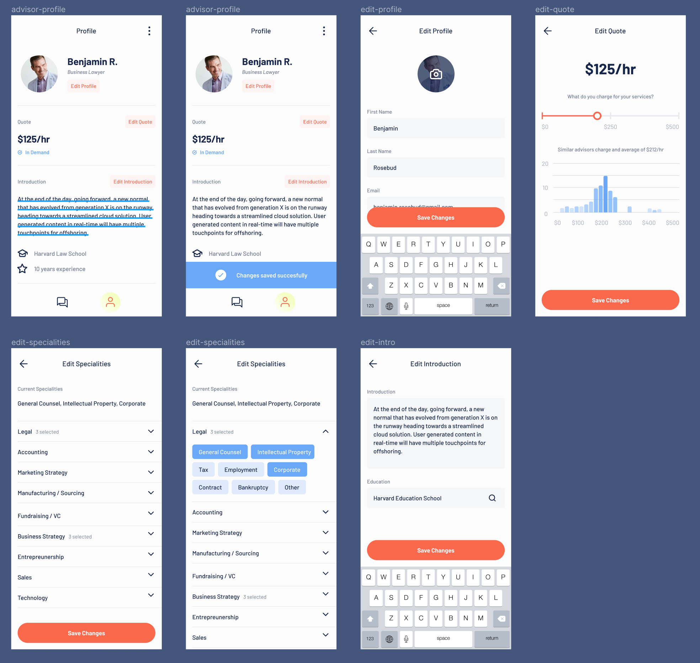

## The Stage
I was asked to consult on a startup whose goal it was to create a platform for advice. The assumption was that there are a lot of up-and-coming entrepreneurs who were willing to pay for advice from established entrepreneurs (advisors), and that these advisors would be happy to share information for a price.

The team was small, it included the Product Owner,  Product Manager, me as Design Lead, a branding Designer and Engineer. It was a distributed team, and we met several times a week to plan and give feedback, the final goal being a concise MVP that we could use to test the market.

## It Begins
We did some branding exercises to figure out the tone of the company, so when we brought information to potential users, we were already somewhat fixed in our brand voice.

We also created some value props, and how our users might be served by them.

## Being Remote & Being Lean
It was important to utilize tools, no matter how low tech or ugly to make sure we were working collaboratively on this project. Being the sprint leader, we needed a way of not being afraid to share ideas, but then also having an anonymous way of voting on these ideas. We too advantage of Ideaz Board to both brainstorm and then vote:

## Initial UX & MVP Planning
Through a panel of users, we created few very engaging personas. I’m not always a fan of creating personas this early, because I worry that we don’t have enough data to create a clear enough picture to make them meaningful. In this situation we had several entrepreneurs in the room and made our best guess at what personas were most important to the brand.

We performed some initial user research in the form of contextual inquiry, and received some really good feedback from users. We got some general ideas of what the user needs were, and focused on a throughout customer journey.

After analyzing this data we felt confident in moving forward to figure out what the first version of the experience should be. We ordered the importance of features, and balanced that against timeline and effort.

## UX / Visual Design / Engineering
This phase all happened concurrently. Using Figma as our main communication method, I could pump out UX, while the Engineer to begin work and the brand designer could create the finished look and feel. It was a collaborative experience where we could continually unblock each other.

## Marketing / Onboarding / Launch
We now how a working prototype, and we spent some time thinking about how we could use what we learned in our persona work and mix that with some content snippets to help convert new users. I put together an animated prototype to get a sense of how it might feel to watch short consult videos, and have a way to take an action and become a user.

<figure class="video_container">
  <iframe width="3 " height="2" src="https://www.youtube.com/embed/c4SKOxz3I_U?controls=0" frameborder="0" theme="light" allow="accelerometer; autoplay; encrypted-media; gyroscope; picture-in-picture" allowfullscreen></iframe>
</figure>

The product is launching to a beta group soon, and the next phase will be a second round of user testing, as we onboard both sides of the marketplace.
