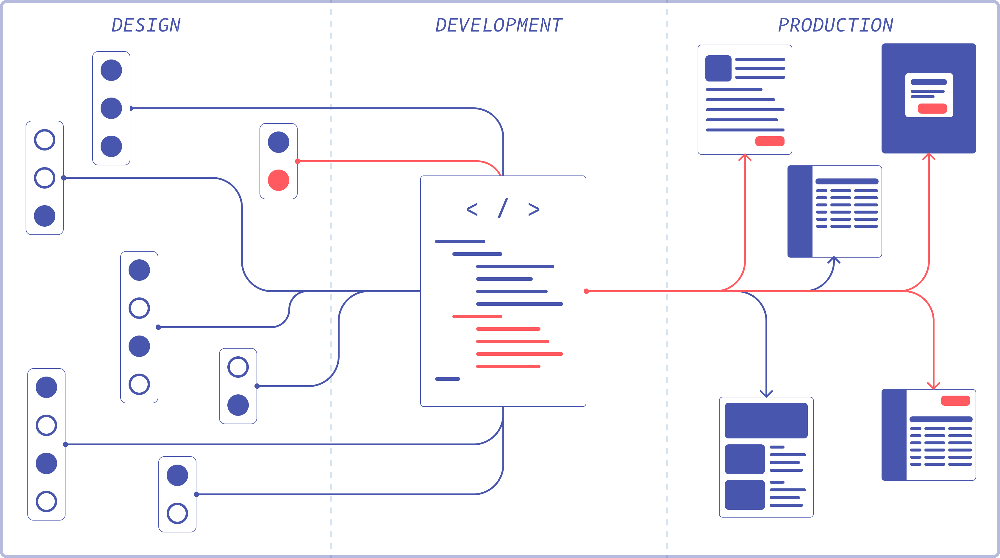

##Everyone thinks they need one, but no one knows how much it costs
Design systems are universally recognized as something product companies need, but few understand how costly they can be—especially when using specialized tools. I would argue that you can probably use what you already have to make some serious headway. This methodology is more for mid-level to large companies, but principles can also be used for smaller startups.

In a lean system, the fastest way to get the flow is with the pipes that you already have. Updating them later may be expensive, but getting water through the entire system is paramount to creating a lasting modality for your product and company. Investing in better pipes at the beginning may be easier to maintain, but might be expensive.

##Creating a full design system only in Figma/Sketch might be a waste of time
Often design systems start with designers putting their heads together and thinking systematically about how the system should work. The problem with this is that it sets up a precedent for waterfall. Putting more effort into building a system without having the right pipes in place creates an immediate backlog of ideas that grow stale and out of touch with reality.

>Nice, all our designs look perfect. Too bad users can't see any of it.

##Planning the system
Planning for a system is a different story. Planning doesn't need to take a lot of time, and consensus can quickly be made about the most common elements. The element that is most common and has the biggest impact would be a great place to start. Maybe a button component?

>Trello is terrific for planning a design system

At this point, designers need to design the button. It doesn't matter if it is the final product. It is more important that everyone agrees on a starting place. It is more important that this process is quick.

##Connecting the system
The most difficult part of this entire process is making the first connection, because it represents an entire slice of the future workflow. Getting to this stage as early as possible will lead to larger gains in the future. It also sets a precedent within the organization that the system is an important and real thing. To make this happen:

###1. You need an advocate from engineering
Find someone who may be a little frustrated with the current front end, and would love to make positive steps to create efficiencies. This will be a long road, so try to find someone to partner with. They can also help answer questions that will come up about implementation.

###2. You need to tap into your org’s current way of doing work
For many mid-sized companies, having a dedicated team for design systems is rare. Tapping into current workflows will increase chances of success, if only because of proximity. I've found that creating a label for design system work leads to better outcomes, rather than having its own board.

>Many different teams can work on the design system when using labels in Jira

###3. You need to persist until the first system element is in production
It is easy to give up and go back to the comfy world of pixels before any elements make it through to your products. I would urge you to wait until you have that successful flow connected.

>We have an actual system with one button element, that end users can experience!

##Connecting more things
At this point, things should be much easier. It is all process from here on out. At this point, focus on the needs of design. An example process:

At this point, things should be much easier. It is all process from here on out. At this point, focus on the needs of design. An example process:

- Designers review every week
- One designer shows work and needs “a new something.”
  - Is this “something” being used somewhere already?
  - Will it be used elsewhere?
  - Does this have specific business logic?
- Designers add to the Figma system.
- Designer on the squad makes a Jira ticket with a label
- Engineering decides if a squad member does it, or if it should be passed to the design system owner.
- It gets developed and everyone can see it.
- Designer reviews and it is pushed into production.

##A more robust system
Now we can go about investing time into making more connections or making the pipes better. Creating a presentation layer for the code will help speed up auditing and development.

>A tool called React Styleguidist to display components

It also doesn't hurt to be more organized within Figma:

>Nicely designed thumbnails make it easy to scan

##Final thoughts
A design system is about momentum, and creating a through-line of a single component is the quickest way to a fully formed system. It creates some scaffolding that other parts can rely on. It gets more people talking and thinking systematically about design. It creates momentum, that at a certain point reaches the top of the hill and can rely more on its own inertia to continue. It will continue to need guidance, but will require less and less effort as the system continues to grow.
