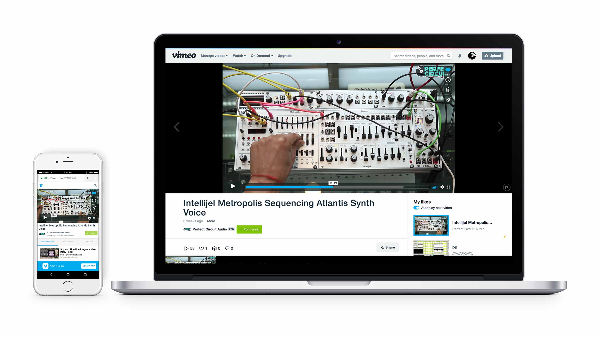
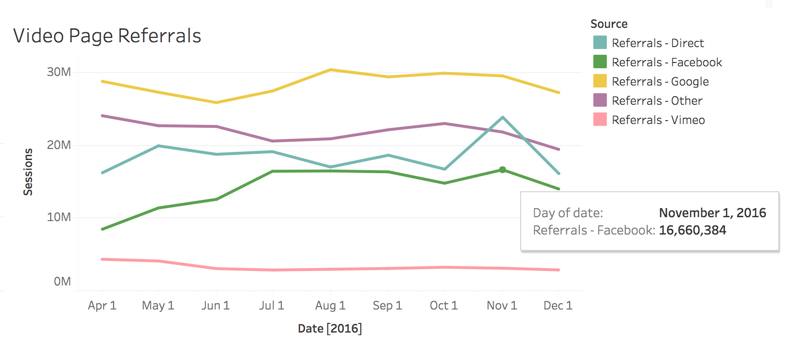
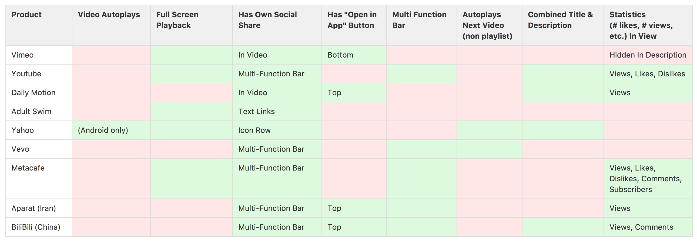
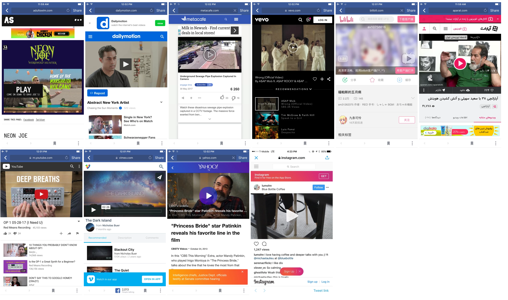
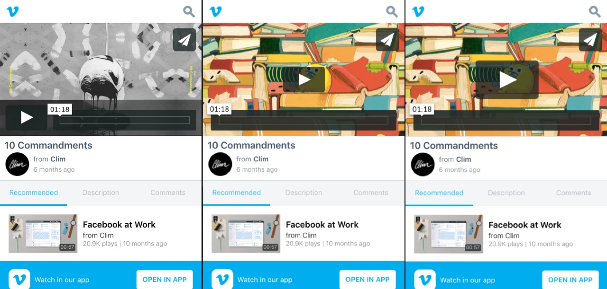
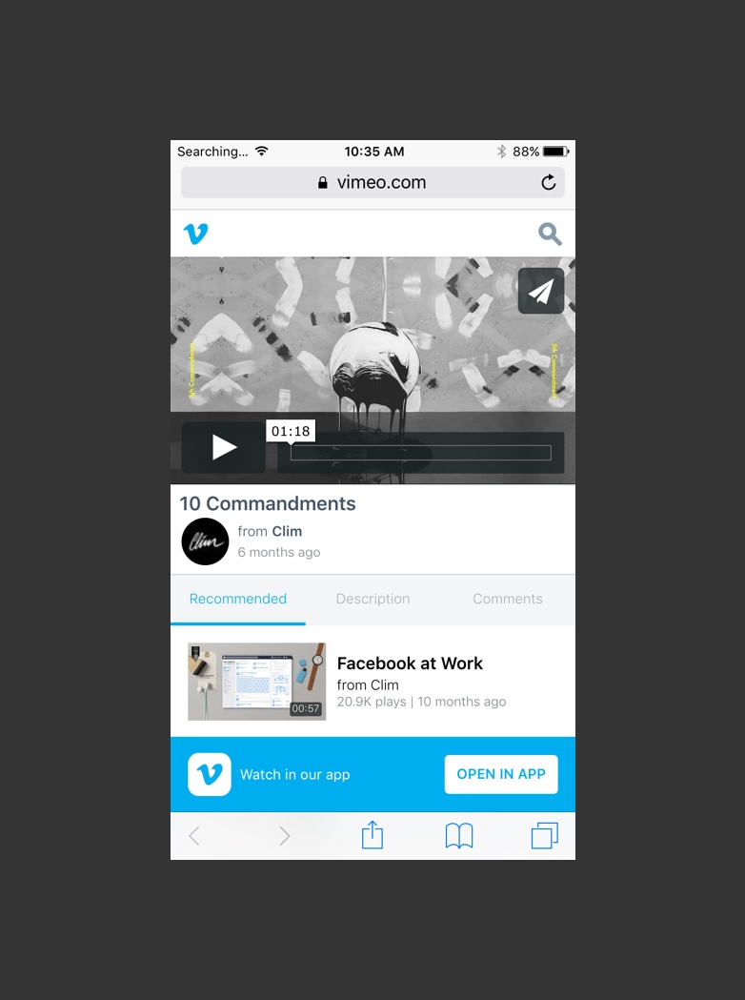
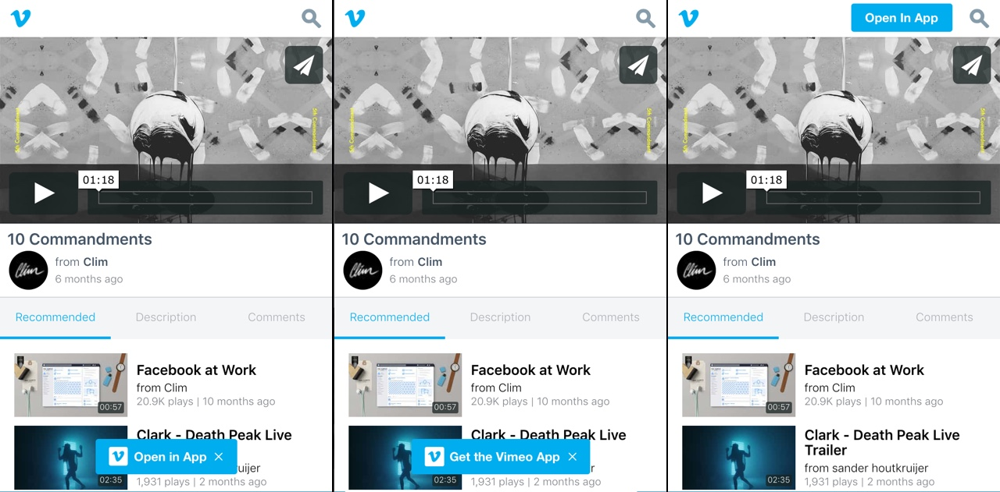
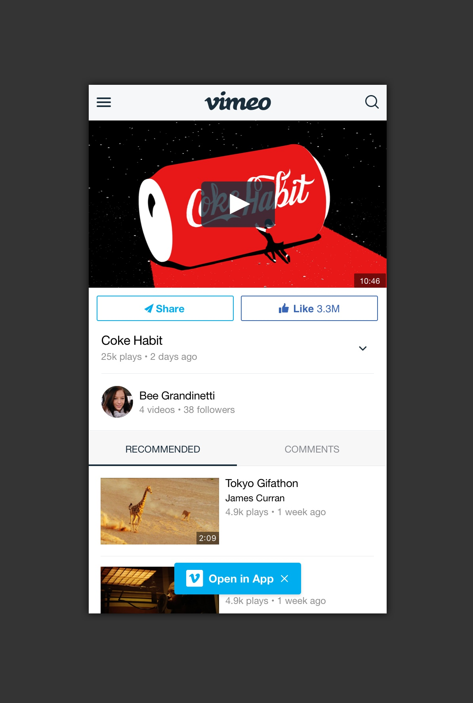
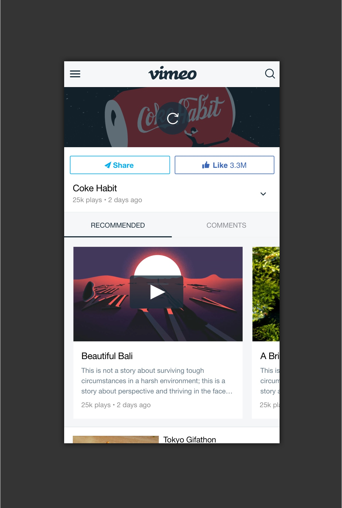
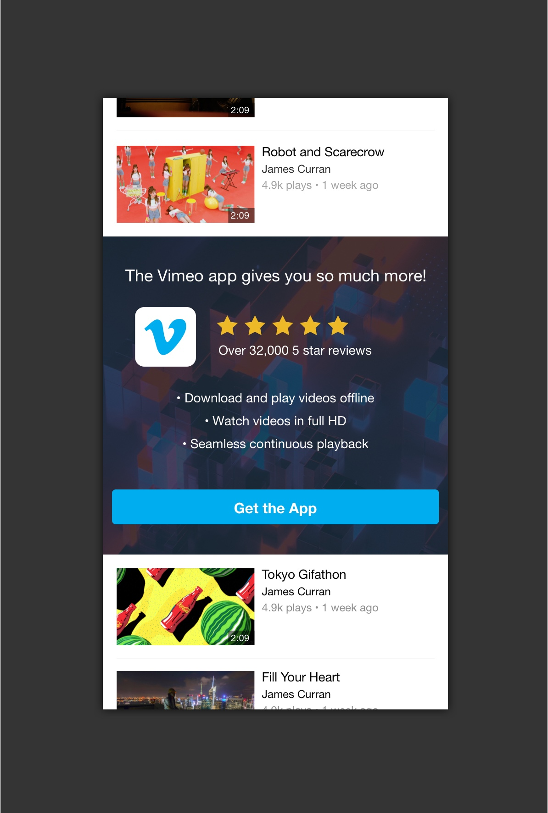

Working for a 10 year old technology company means there are a lot of different sources of historical information, data and research. I am interested in taking a little from each of these categories and creating A/B tests that can be run quickly, and have significant impact on our metrics, user experience, and hopefully our bottom line.

## The Background

>An example of the clip page on desktop and mobile devices.

The clip page as it is referenced at Vimeo, is possibly the single most important consuming view in all of Vimeo’s web and mobile traffic. This page is where most people watch videos, where they are linked to, and where they share from.

The current design has some great opportunities for redesign, and I was tasked with increasing certain metrics on the page, while at the same time give the page a brand refresh.

## Analytics

Traffic from social, especially Facebook is the biggest source of traffic to our mobile web experience. There are approximately 9,000,000 weekly views from Facebook alone, and that means there are 9,000,000 chances for us to get people more involved with Vimeo in the hopes that we can turn a percentage of those into creators who pay for upgrades.

## The Metrics
The metrics are pretty straightforward:

1. Increase the percentage of users who visit the clip page and then play a video (reduce the bounce rate)
2. Increase the percentage of users who share.
3. Increase the percentage of users who click the app install button
4. Increase total time spent watching

## Competitive Analysis
How have some other companies trying to solve some of these problems? I looked at a lot of different services, and some patterns started to emerge.

>Patterns that emerged included a lack of autoplay, and custom social sharing.

## Test 1 - The Play Button
The first test was designed to challenge the placement of the play button. From some competitive analysis, I found that Vimeo was one of the only products that didn’t have the button. Only Vimeo and one other competitor didn’t have the play button centered.

>Example play buttons from many different products.

The play button may or may not have a correlation with the metric of playing a video once landing on the page, and we wanted to get some data behind this concept. The plan was to run two tests, one that moved to the play button to the center, and a variation which made the play button 25% bigger.

>The control design, one with button that is centered, one that is 25% bigger.

## Test 2 - The App Banner

>The current design. My hypothesis is that because the banner extends full width, users tend to overlook the banner.

Based on patterns found in different mobile applications, I wanted to test a different version of the app banner, and see if various iterations would increase the number of taps to download the native app. We decided on a couple different variations to test placement, as well as the language in the button.

## The Results
The results of the test has been slow, but a few verified results have come from the business intelligence team:

1. Increase the percentage of users who visit the clip page and then play a video (reduce the bounce rate). _Bounce rate reduced by **3%**_
2. Increase the percentage of users who share. _No significant change_
3. Increase the percentage of users who click the app install button. _App installs increased by **4.3%**_
4. Increase total time spent watching. _No significant change_

## The Designs

>Redesign concept for when someone clicks from Facebook.

>What the user would see after watching the video.

>A subtle upsell to the user that hopefully convinced them to get the app.

