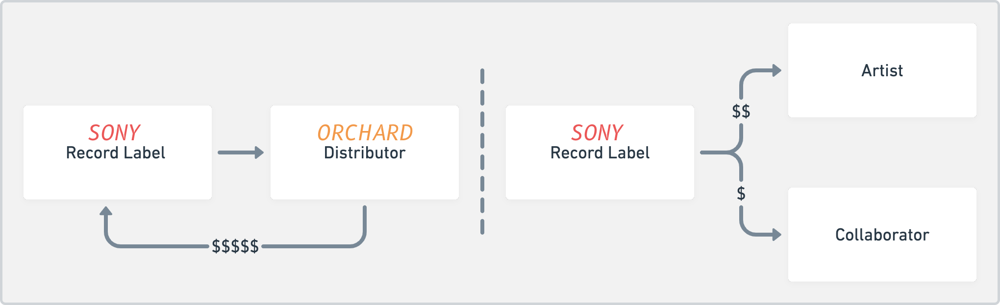
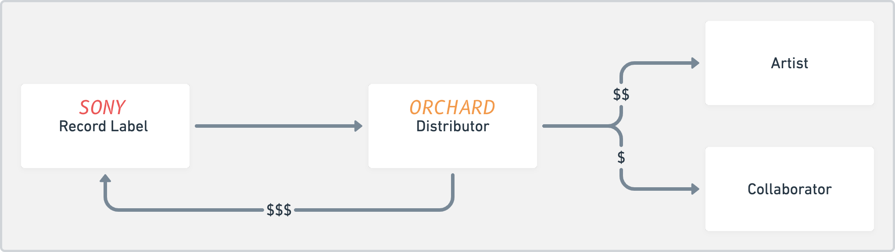
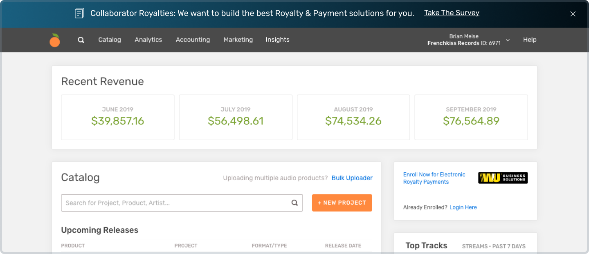
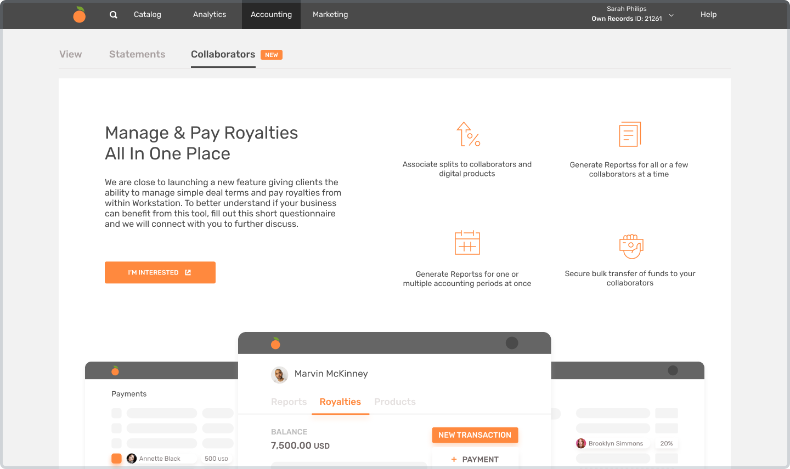
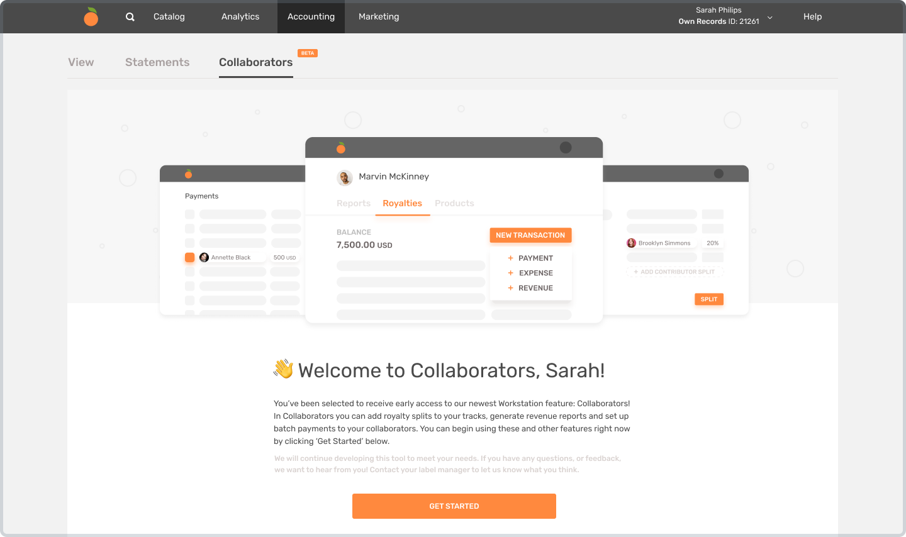
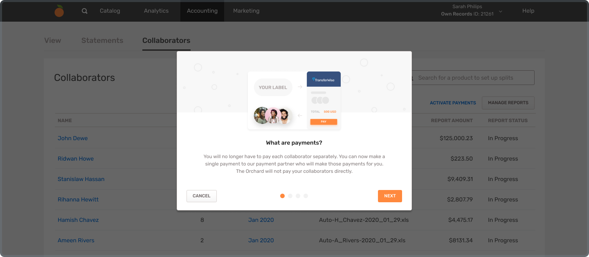
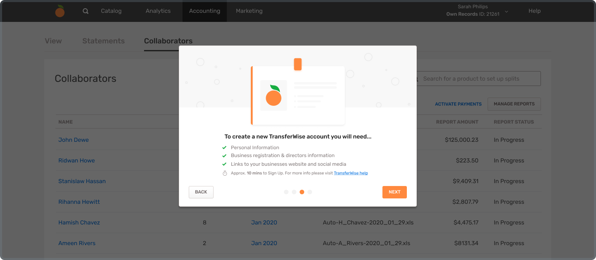
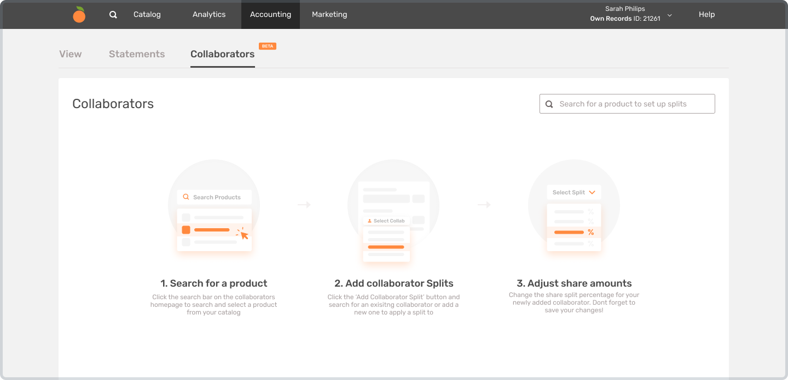
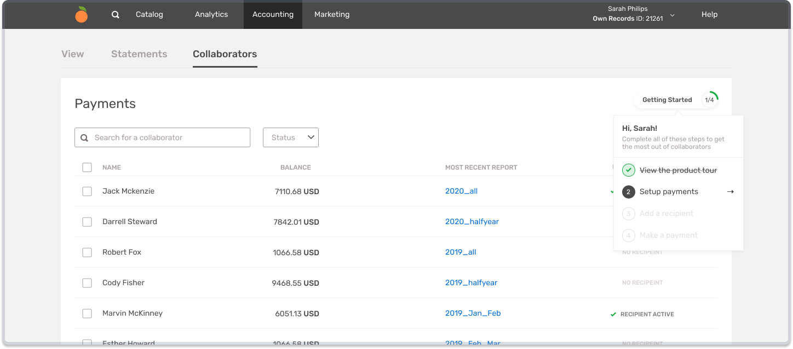

##A Shifting Industry
It is obvious that the music industry has changed dramatically over the last 15 years, with the advent of music streaming services and the near death of physical products. Lesser known is how business models in the industry are shifting, especially as it relates to how music is now distributed, how metadata is managed, and how music creators and contributors relate to the companies that manage their music.

Record labels no longer control all aspects of an artists output, and artists are making moves to become their own company. Artists now want direct relationships with large scale music distributors like The Orchard, and all parties involved want more transparency—especially when it comes to money.

##From Service Provider to Service "Bank"

>Traditionally, record labels work directly with distributors, collect all royalties and then separately pay their artists and contributors.

The Orchard is now owned by Sony Music and the partnership has moved past just providing a distribution service. The Orchard can now act more as a bank and hold royalties. By using technology to cut down on manual accounting, Sony can offload more accounting resources and focus on other parts of their business.

This also helps The Orchard because as a bank, The Orchard has more access to cash flow and can strategize on ways to capitalize on this flow. It also expands The Orchard's offering, and helps to gain new customers of all sizes.

>The Orchard as Service "Bank"

##The Product Design Opportunity
Creating an experience for record labels to manage and pay their artists and collaborators became the initial MVP of a larger suite of business tools. It is the first time that the door has been opened to non-partner entities, essentially creating the business model of B2B2C for The Orchard.

##Soliciting User Feedback

>A simple banner was used it illicit user feedback

The first step was to recruit users to get more information about how they work and more specific information about their business—information about how much detail they need, the size of their business, how many artists they manage, what format they use for their statements, and how they currently calculate royalties. We also gave them an opportunity to give some qualitative feedback:

>"Artists like drill down detail - they want to see who and where it's selling."

>"Being able to split our net revenue by release to pay band members would be great."

>"Would love the option to input artist / campaign expenses within The Orchard."

>"Most often I add the artist's royalty in a spreadsheet where I collect all income and expenses for the artists, like a bank account. When there is more than a certain amount in the artist's account, I send the artist an email and ask for an invoice. Most of the artists only get a sales-report with an amount they can charge me for digital distribution (my commission has already been deducted)."

>"Really looking forward to see how you include a royalty tool which would take away tons of work, as we still do royalties by hand for each product. :)"

##Priming

>Priming companies was crucial, as this was a fundamental change to how business manage finances

After receiving a lot of great information, we launched to a very small group of companies. We also added some important priming information to let other companies know that this product was coming. It also allowed us to do another round of user feedback and iterate on the current version of the product. We also used this information to create an onboarding experience to guide customers through a somewhat tricky transition.

After things were in place, we invited more customers to join the beta, starting with those that responded to our survey.

##User Onboarding

Providing a friendly welcome was important, as the setup process was a little complicated.

After getting started, we walked them through every part of the process in detail. It was a first for The Orchard to provide this kind of hand holding and set up patterns for future releases to go bigger and faster.

Getting the right amount of information about setting up payments was a balancing act. By providing too much information, we saw signups slow down. With too little information, we received too many customer service inquiries.

##Recapturing

If a user signed up for the portal, but didn't yet set up payments, we designed a path for them to get started with managing their royalties. Adding this capability would increase the likelihood that they would eventually sign up to run payments through us.

After users started managing their royalties, we gamified setting up payments to make a logical path for users to get the most out of the portal.

#Results
We have had really great reception so far, and many companies have signed up to use our system to manage their royalties and finances. This part of the business is on track to make The Orchard more money while providing a much needed service, and will make it easier for both The Orchard and their customers to adapt to future changes in the industry.
