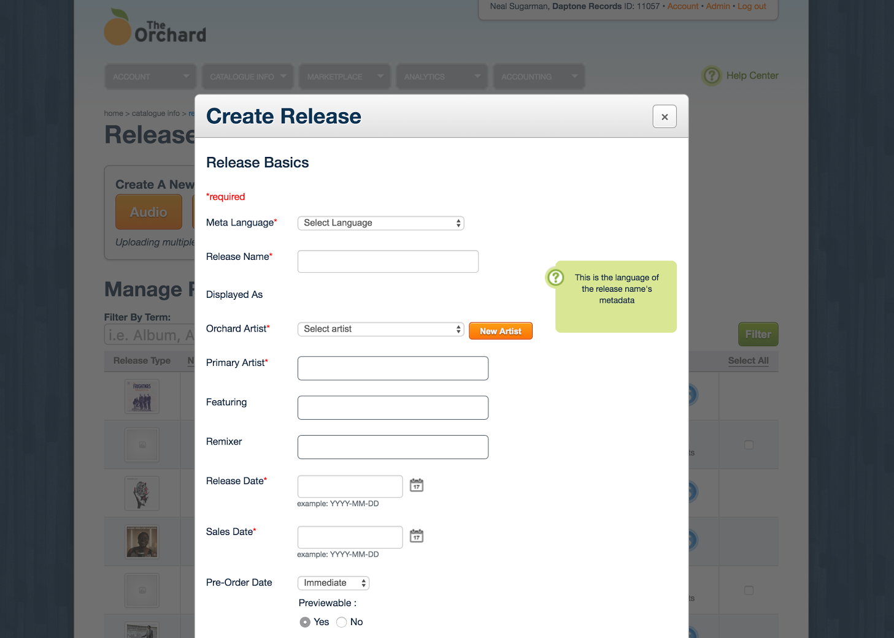

## The Product Being Redesigned
The Orchard's application suite Workstation was originally designed in 2006, and has become outdated both visually and out of touch with the industry.

78% of The Orchard’s revenue comes from audio content, and all this content must be entered through Workstation.

The old experience experience was a long and precarious form in a modal. Users hated this thing. It was slow, and often closed without saving. It had become difficult to maintain and was behind in style, language and interaction.

After using the system for a month for actual products I was releasing, I ran a series of workshops to start the redesign.

## Workshops
The workshop team consisted of a designer, a product manager, a technology director, and also the VP of Product who acted as the decision maker. It made it much easier to express more user centered experiences for me because I had actually used the system in a real life context.

In this exercise, we did a card sorting exercise to define the critical user path for Release Builder.

We then moved on to some quickfire design exercises to get people thinking in terms of user experience. The first was crazy 8's, where we sketched out 8 quick ideas. We then voted on the best ideas.

In another exercise, everyone is the group sketched ideas about the entire flow and we then voted on the best ideas.

The sprint allowed us to make decisions as a team, and be unified in our strategy.

## Wireframes and Stakeholder Feedback
The next part of the process was for me to quickly create wireframes that were sent to members of the sprint team, and also to stakeholders. We learned that our particular audience needed more fidelity, but using comic sans helped them know that this was just a representation of designs to come.

We uncovered some pretty serious holes in requirements that were able to be updated before moving into an in-depth design or development cycle.

## High Fidelity and User Testing
Next, I created high fidelity designs and prototyped the experience in Invision. I used Lookback.io to interview some users and validate our ideas before being developed.

We identified some problems with the designs, mainly dealing with navigation.

The next step was to work with the product managers to figure out a release plan for the new version.

## The "Final" Design
In product design, there is no real final design, as things should change as users and the business change over time.

## Gathering User Feedback
The initial response was overwhelmingly positive, and it allowed us to launch the redesign to launch to larger groups and continue to get more and more feedback.

After a year, we gave another survey, and found that while design and usability had improved, the bigger issue was speed and performance. The company is currently investing heavily in improving architecture and load times. Here is a rundown of findings and metrics before and after the redesign:

### _Learning:_ The system is too slow
#### Metric - Speed & Performance Score
- Before **2.83 / 5**
- After **3.87 / 5**

### _Learning:_ Users needed more tools for scheduling their product releases
#### Metric - Overall Customer Satisfaction Score
- Before **3.14 / 5**
- After **3.75 / 5**

### _Learning:_ Users wanted more feedback about errors
#### Metric - Rate of errors in form fields via Mouseflow
- Before **21%**
- After **12%**

<!-- **Italic Mountains** _Bookmarksgrove_

[Longe and Parole](http://google.com)

1.  So baboon this
2.  Mounted militant weasel gregariously admonishingly straightly hey
3.  Dear foresaw hungry and much some overhung
4.  Rash opossum less because less some amid besides yikes jeepers frenetic
    impassive fruitlessly shut

> The copy warned the Little Blind Text, that where it came from it would have
> been rewritten a thousand times and everything that was left from its origin
> would be the word "and" and the Little Blind Text should turn around and
> return to its own, safe country. -->
